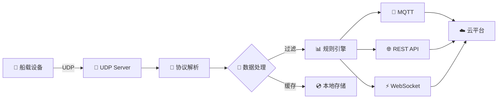

# ⛵ Edge Gateway - 船载边缘计算网关

[](https://go.dev/)
[](LICENSE)
[](https://github.com)
[](https://github.com)
[](https://github.com)

**🚢 高性能工业级船载边缘计算网关系统**

*连接船载嵌入式设备与云端服务的智能桥梁*

[快速开始](#-快速开始) • [功能特性](#-核心功能) • [架构设计](#-系统架构) • [文档](#-文档) • [贡献指南](#-贡献)

---

## 📖 项目简介

船载边缘计算网关是一个高性能的工业级网关系统，专为海洋船舶环境设计。系统采用 **Go 语言**开发，提供稳定可靠的数据采集、协议转换和数据分发能力，是船载物联网系统的核心组件。

### ✨ 为什么选择 Edge Gateway? 

- 🎯 **专为船舶设计** - 适应海洋环境的特殊需求
- ⚡ **极致性能** - 基于 Go 协程的高并发架构
- 🛡️ **工业级可靠性** - 7x24 小时稳定运行
- 🔌 **即插即用** - 简单配置，快速部署

---

## 🚀 核心功能

### 🔽 南向设备接入

#### 📡 UDP 通信
- 统一接入船载嵌入式设备
- 高效的二进制协议支持
- 毫秒级延迟响应

#### 🔍 设备管理
- 自动发现与注册
- 实时状态监控
- 设备健康检查

#### 🔧 协议解析
- 灵活的数据包解析
- CRC 校验与纠错
- 多协议支持扩展

#### 🔄 断线重连
- 自动检测设备状态
- 智能重连机制
- 异常处理与恢复

### 🔼 北向数据服务

| 服务类型 | 图标 | 说明 | 特性 |
|---------|------|------|------|
| **MQTT 服务** | 📨 | 实时数据推送 | QoS 支持、断线缓存 |
| **RESTful API** | 🌐 | HTTP 数据接口 | 标准化、易集成 |
| **WebSocket** | ⚡ | 实时数据订阅 | 双向通信、低延迟 |
| **数据转换** | 🔀 | 协议适配 | 格式标准化、映射配置 |

### 💾 数据处理引擎

```
┌─────────────┐    ┌─────────────┐    ┌─────────────┐    ┌─────────────┐
│  📥 采集     │ -> │  🔄 转换     │ -> │  📊 处理     │ -> │  📤 分发     │
│  实时接收    │    │  协议解析    │    │  规则引擎    │    │  多端推送    │
└─────────────┘    └─────────────┘    └─────────────┘    └─────────────┘
```

#### ⚡ 实时处理
- 毫秒级数据流处理
- 流式计算引擎
- 事件驱动架构

#### 💿 数据缓存
- 本地缓存机制
- 数据不丢失保证
- 离线缓存队列

#### 🎯 规则引擎
- 数据过滤与筛选
- 实时聚合计算
- 智能告警触发

#### 💾 持久化存储
- 本地时序数据库
- 历史数据查询
- 数据备份恢复

---

## 🎨 技术特性

| 特性 | 说明 | 优势 |
| ----|-----|-----|
| ⚡ **高性能** | Go 协程并发模型 | 支持 10,000+ 并发连接 |
| 🛡️ **高可靠** | 完善的容错机制 | 99.9% 可用性保证 |
| 🔒 **安全性** | TLS/SSL 加密 | 设备认证 + 数据加密 |
| 📊 **可观测** | 全链路追踪 | 日志 + 指标 + 追踪 |
| 🔧 **易部署** | 单一二进制文件 | Docker/K8s 支持 |
| ⚙️ **可配置** | 灵活配置管理 | 热更新 + 版本控制 |

---

## 🌊 应用场景

### 🚢 船舶监控
- 智能船舶监控系统
- 实时数据采集与分析

### 🌊 海洋物联网
- 海洋数据采集
- 环境监测与预警

### ⚙️ 设备管理
- 船载设备远程管理
- 故障诊断与维护

### 📊 大数据平台
- 航运数据接入
- 智能分析与决策

---

## 🛠️ 技术栈

### 核心技术

[](https://go.dev/)
[](https://www.eclipse.org/paho/)
[](https://gin-gonic.com/)

### 数据存储

[](https://www.sqlite.org/)
[](https://www.influxdata.com/)
[](https://redis.io/)

### 工具链

[](https://github.com/uber-go/zap)
[](https://github.com/spf13/viper)
[](https://www.docker.com/)

---

## 🏗️ 系统架构

```
┌─────────────────────────────────────────────────────────────┐
│                    ☁️  云端服务 / 应用层                      │
│         📊 MQTT Broker  │  🌐 API Gateway  │  📱 Web App    │
└─────────────────────────┬───────────────────────────────────┘
                          │
                 MQTT │ HTTP │ WebSocket
                          │
┌─────────────────────────┴───────────────────────────────────┐
│              ⚡ Edge Computing Gateway (网关核心)            │
│  ┌───────────────────────────────────────────────────────┐  │
│  │              🔼 北向服务层 (Northbound)               │  │
│  │  ┌────────────┐  ┌──────────┐  ┌─────────────┐      │  │
│  │  │ 📨 MQTT    │  │ 🌐 REST  │  │ ⚡ WebSocket │      │  │
│  │  │   Client   │  │   API    │  │   Server    │      │  │
│  │  └────────────┘  └──────────┘  └─────────────┘      │  │
│  └───────────────────────────────────────────────────────┘  │
│                                                              │
│  ┌───────────────────────────────────────────────────────┐  │
│  │            💾 数据处理 & 规则引擎                      │  │
│  │  🔄 协议转换  │  📊 数据聚合  │  🎯 规则匹配         │  │
│  │  💿 本地缓存  │  🔍 数据过滤  │  ⚠️ 告警处理          │  │
│  └───────────────────────────────────────────────────────┘  │
│                                                              │
│  ┌───────────────────────────────────────────────────────┐  │
│  │              🔽 南向接入层 (Southbound)               │  │
│  │  ┌────────────────────────────────────────────────┐   │  │
│  │  │  📡 UDP Server  │  🔧 设备管理  │  🔍 协议解析 │   │  │
│  │  └────────────────────────────────────────────────┘   │  │
│  └───────────────────────────────────────────────────────┘  │
└─────────────────────────┬───────────────────────────────────┘
                          │
                        UDP
                          │
┌─────────────────────────┴───────────────────────────────────┐
│              🚢 船载嵌入式设备集群                           │
│   📡 传感器  │  ⚙️ 控制器  │  📊 采集模块  │  🔌 执行器     │
└─────────────────────────────────────────────────────────────┘
```

### 🔄 数据流向



---

## 🚀 快速开始

### 📋 环境要求

- 🐹 **Go**:  1.21 或更高版本
- 🐳 **Docker**: 20.10+ (可选)
- 📦 **Git**: 用于克隆代码

### 📥 安装

#### 方式 1: 源码编译

```bash
# 1️⃣ 克隆仓库
git clone https://github.com/SoloHui/edge-gateway.git
cd edge-gateway

# 2️⃣ 下载依赖
go mod download

# 3️⃣ 编译
go build -o edge-gateway ./cmd/gateway

# 4️⃣ 运行
./edge-gateway --config config.yaml
```

#### 方式 2: Docker 部署

```bash
# 🐳 使用 Docker
docker pull solohui/edge-gateway:latest
docker run -d \
  --name edge-gateway \
  -p 8080:8080 \
  -p 1883:1883 \
  -v $(pwd)/config:/app/config \
  solohui/edge-gateway:latest
```

#### 方式 3: Docker Compose

```bash
# 📦 使用 Docker Compose
docker-compose up -d
```

### ⚙️ 配置

创建 `config.yaml` 配置文件:

```yaml
# 🌐 服务配置
server:
  name: "edge-gateway"
  port:  8080
  mode: "production"

# 📡 UDP 配置
udp:
  port: 9999
  buffer_size: 4096
  timeout: 30s

# 📨 MQTT 配置
mqtt:
  broker: "tcp://mqtt. example.com:1883"
  client_id: "edge-gateway-001"
  username: "gateway"
  password: "your-password"
  qos: 1

# 💾 数据库配置
database:
  type: "sqlite"
  path:  "./data/gateway.db"

# 📊 日志配置
logging:
  level: "info"
  output: "stdout"
  file: "./logs/gateway.log"
```

### 🎮 运行

```bash
# 📝 查看帮助
./edge-gateway --help

# 🚀 启动服务
./edge-gateway start

# 📊 查看状态
./edge-gateway status

# 🛑 停止服务
./edge-gateway stop
```

---

## 📡 API 文档

### 🌐 RESTful API

#### 获取设备列表

```http
GET /api/v1/devices
```

**响应示例:**
```json
{
  "code": 0,
  "message": "success",
  "data": [
    {
      "id": "device001",
      "name": "温度传感器",
      "status": "online",
      "last_seen": "2024-01-01T12:00:00Z"
    }
  ]
}
```

#### 获取实时数据

```http
GET /api/v1/data/realtime/: device_id
```

### 📨 MQTT Topics

| Topic | 类型 | 说明 |
|-------|------|------|
| `ship/data/+` | 发布 | 设备实时数据 |
| `ship/status/+` | 发布 | 设备状态更新 |
| `ship/alarm/+` | 发布 | 告警信息 |
| `ship/control/+` | 订阅 | 设备控制指令 |

### ⚡ WebSocket

连接地址: `ws://localhost:8080/ws/data`

**订阅消息:**
```json
{
  "action": "subscribe",
  "device_id": "device001",
  "data_type": "temperature"
}
```

---

## 📊 监控与运维

### 📈 性能指标

通过 Prometheus 暴露指标:

```
http://localhost:8080/metrics
```

**关键指标:**
- `gateway_udp_packets_total` - UDP 数据包总数
- `gateway_mqtt_messages_sent` - MQTT 消息发送数
- `gateway_devices_online` - 在线设备数
- `gateway_processing_latency` - 处理延迟

### 📝 日志查看

```bash
# 实时日志
tail -f logs/gateway.log

# 按级别过滤
grep "ERROR" logs/gateway.log

# 日志分析
./edge-gateway logs analyze
```

---

## 🧪 测试

### 运行测试

```bash
# 🧪 单元测试
go test ./... 

# 📊 带覆盖率
go test -cover ./...

# 🔍 详细输出
go test -v ./... 

# ⚡ 基准测试
go test -bench=. ./...
```

### 集成测试

```bash
# 🔗 集成测试
go test -tags=integration ./tests/integration
```

---

## 📚 文档

- 📖 [完整文档](https://docs.example.com)
- 🚀 [快速开始指南](https://docs.example.com/quick-start)
- 🏗️ [架构设计](https://docs.example.com/architecture)
- 🔌 [API 参考](https://docs.example.com/api)
- ❓ [FAQ](https://docs.example.com/faq)

---

## 🤝 贡献

我们欢迎所有形式的贡献!  👏

### 贡献方式

1. 🍴 Fork 本仓库
2. 🌿 创建特性分支 (`git checkout -b feature/AmazingFeature`)
3. ✍️ 提交更改 (`git commit -m 'Add some AmazingFeature'`)
4. 📤 推送到分支 (`git push origin feature/AmazingFeature`)
5. 🎉 开启 Pull Request

### 📝 贡献指南

- 遵循 Go 代码规范
- 添加必要的单元测试
- 更新相关文档
- 提交信息清晰明了

### 🐛 Bug 报告

发现 Bug?  请[提交 Issue](https://github.com/SoloHui/edge-gateway/issues)

---

## 📜 许可证

本项目采用 [MIT 许可证](LICENSE)

```
MIT License

Copyright (c) 2024 SoloHui

Permission is hereby granted, free of charge, to any person obtaining a copy
of this software and associated documentation files (the "Software"), to deal
in the Software without restriction... 
```

---

## 👥 团队

### 核心贡献者

<table>
<tr>
<td align="center">
<a href="https://github.com/SoloHui">
<br />
<sub><b>SoloHui</b></sub>
</a><br />
💻 🎨 📖 🚀
</td>
</tr>
</table>

---

## 📈 提交历史

### 最近更新

- 🎉 **2024-12**:  初始化项目，完成核心架构设计
- ✨ **2024-12**:  实现 UDP 设备接入层
- 🚀 **2024-12**:  添加 MQTT 数据推送功能
- 📊 **2024-12**:  集成 REST API 和 WebSocket
- 🔧 **2024-12**: 完善配置管理和日志系统
- 🐛 **2024-12**:  修复设备断线重连问题
- 📝 **2024-12**: 完善项目文档

### 提交统计


### 里程碑

| 版本 | 日期 | 主要内容 |
|------|------|----------|
| 🎯 v1.0.0 | 2024-12 | 初始版本发布 |
| 🔧 v1.1.0 | 计划中 | 增强设备管理功能 |
| 📊 v1.2.0 | 计划中 | 添加数据分析模块 |
| 🚀 v2.0.0 | 计划中 | 云原生架构升级 |

---

## 🙏 致谢

感谢以下开源项目: 

- [Go](https://go.dev/) - 强大的编程语言
- [Gin](https://gin-gonic.com/) - 高性能 Web 框架
- [Paho MQTT](https://www.eclipse.org/paho/) - MQTT 客户端库
- [Zap](https://github.com/uber-go/zap) - 高性能日志库
- [Viper](https://github.com/spf13/viper) - 配置管理库

---

## 📞 联系我们

- 📧 Email: solohui@example.com
- 💬 Discussions: [GitHub Discussions](https://github.com/SoloHui/edge-gateway/discussions)
- 📝 Blog: [技术博客](https://blog.solohui.com)
- 🐙 GitHub: [@SoloHui](https://github.com/SoloHui)

---

**⛵ 让船载物联网更简单 ⛵**

Made with ❤️ by [SoloHui](https://github.com/SoloHui)

[⬆ 回到顶部](#-edge-gateway---船载边缘计算网关)